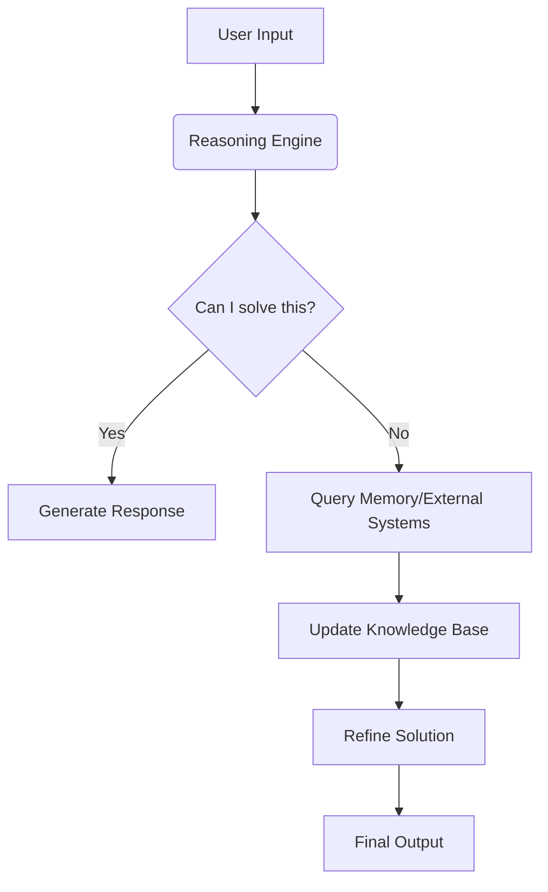

# Agentic LLM Systems

## Introduction
Agentic Large Language Models (LLMs) are autonomous systems that combine language understanding with goal-directed behavior. They operate through a cycle of **planning**, **acting**, and **learning** to achieve complex tasks.

## Key Components
1. **Reasoning Engine**: Core LLM capable of logical deduction and problem-solving
2. **Memory Module**: Stores context, history, and learned patterns
3. **Action Interface**: Enables interaction with external systems/APIs
4. **Feedback Loop**: Continuously learns from outcomes and adjusts strategies

## How It Works

## Benefits
- Autonomous task execution
- Adaptive learning capabilities
- Multi-step problem solving
- Context-aware interactions

## Getting Started
1. Clone the repository: `git clone https://github.com/Leonai-do/AgentOS-2.0.git`
2. Install dependencies: `pip install -r requirements.txt`
3. Configure environment variables in `.env` file